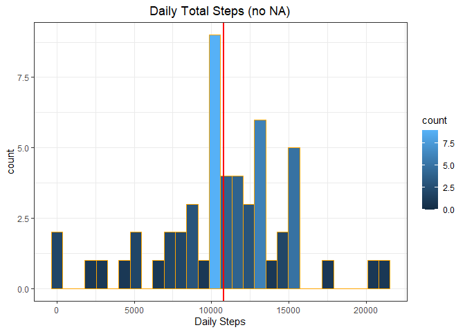
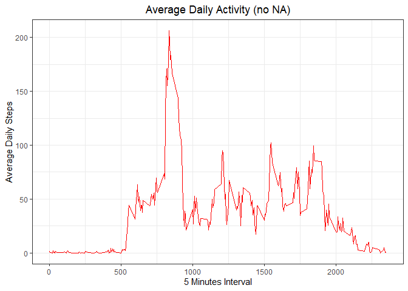
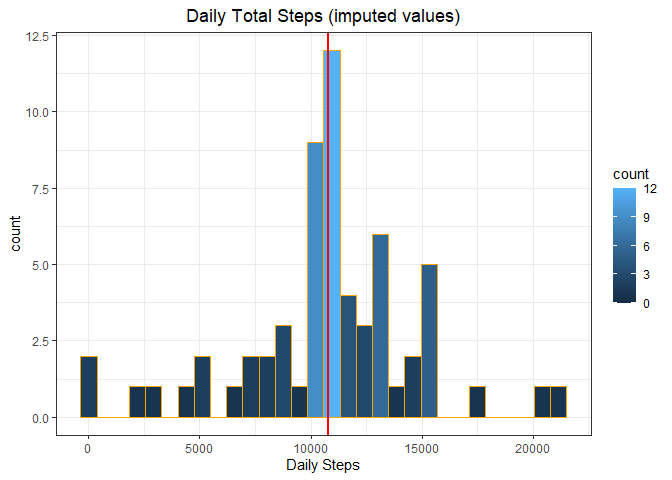
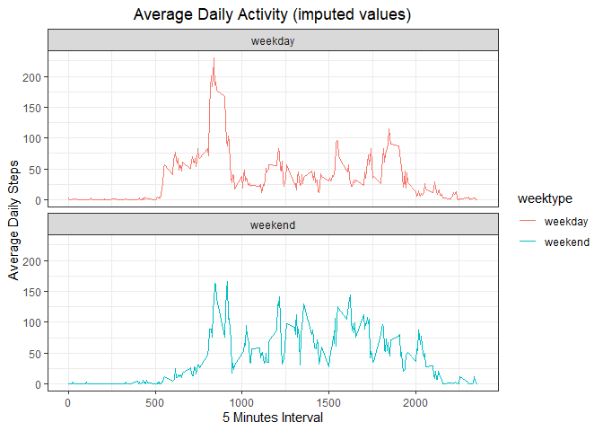
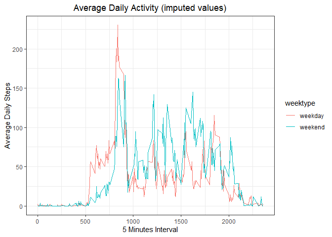

## ***Introduction***

It is now possible to collect a large amount of data about personal movement using activity monitoring devices such as a [Fitbit](https://www.fitbit.com/), [Nike Fuelband](https://www.fitbit.com/), or [Jawbone Up](https://www.jawbone.com/). These type of devices are part of the “quantified self” movement – a group of enthusiasts who take measurements about themselves regularly to improve their health, to find patterns in their behavior, or because they are tech geeks. But these data remain under-utilized both because the raw data are hard to obtain and there is a lack of statistical methods and software for processing and interpreting the data.

This assignment makes use of data from a personal activity monitoring device. This device collects data at 5 minute intervals through out the day. The data consists of two months of data from an anonymous individual collected during the months of October and November, 2012 and include the number of steps taken in 5 minute intervals each day.


The data for this assignment can be downloaded from the course web site:  

- Dataset: [*Activity monitoring data*](https://d396qusza40orc.cloudfront.net/repdata%2Fdata%2Factivity.zip) [52K]  

The variables included in this dataset are:  

- **steps**: Number of steps taking in a 5-minute interval (missing values are coded as **NA**)  

- **date**: The date on which the measurement was taken in YYYY-MM-DD format  

- **interval**: Identifier for the 5-minute interval in which measurement was taken  

The dataset is stored in a comma-separated-value (CSV) file and there are a total of 17,568 observations in this dataset. 


### ***Loading and preprocessing the data***  

The libraries use here are for the following uses:

- **ggplot2** for the plotting  
- **dplyr** to manipulate the dataframe  
- **lubridate** to manipulate Date and time  


```r
# loading the necessary libraries
library(ggplot2)
```

```
## Warning: package 'ggplot2' was built under R version 4.0.2
```

```r
library(dplyr)
```

```
## 
## Attaching package: 'dplyr'
```

```
## The following objects are masked from 'package:stats':
## 
##     filter, lag
```

```
## The following objects are masked from 'package:base':
## 
##     intersect, setdiff, setequal, union
```

```r
library(lubridate)
```

```
## 
## Attaching package: 'lubridate'
```

```
## The following objects are masked from 'package:base':
## 
##     date, intersect, setdiff, union
```

#####       **Getting the data**   


```r
# assigning the fileurl variable the url for the dataset
fileurl <- "https://d396qusza40orc.cloudfront.net/repdata%2Fdata%2Factivity.zip"


# assigning zipfile variable the file name
zipfile <- "./Data/repdata_data_activity.zip"


# assigning filedir variable the path directory path
filedir <- "./Data"

# if directory path does not exists create it
unzip_path <- "./Data"
if(!file.exists(filedir)) {
  dir.create(filedir)
}

# downloading the dataset to the Data folder on the local drive
download.file(fileurl, file.path(zipfile))


# unzipping the dataset to the Data directory
unzip(zipfile, exdir=unzip_path) 
datafile <- file.path(unzip_path, "activity.csv")


# loading dataframe to mydf variable
mydf <- read.csv(file = datafile)
```

##### ***Preprocessing the data***


```r
# checking the dataset mydf
head(mydf)
```

```
##   steps       date interval
## 1    NA 2012-10-01        0
## 2    NA 2012-10-01        5
## 3    NA 2012-10-01       10
## 4    NA 2012-10-01       15
## 5    NA 2012-10-01       20
## 6    NA 2012-10-01       25
```

```r
# check dataset mydf columns' name
colnames(mydf)
```

```
## [1] "steps"    "date"     "interval"
```

```r
# running summary of the dataset mydf
summary(mydf)
```

```
##      steps            date              interval     
##  Min.   :  0.00   Length:17568       Min.   :   0.0  
##  1st Qu.:  0.00   Class :character   1st Qu.: 588.8  
##  Median :  0.00   Mode  :character   Median :1177.5  
##  Mean   : 37.38                      Mean   :1177.5  
##  3rd Qu.: 12.00                      3rd Qu.:1766.2  
##  Max.   :806.00                      Max.   :2355.0  
##  NA's   :2304
```

```r
# converting date from character to dateformat
mydf$date <- ymd(mydf$date)


# making a new dataset mydfr without NA
mydfr <- subset(mydf, (!is.na(mydf$steps)))


# running summary of the dataset mydfr and checking class
summary(mydfr)
```

```
##      steps             date               interval     
##  Min.   :  0.00   Min.   :2012-10-02   Min.   :   0.0  
##  1st Qu.:  0.00   1st Qu.:2012-10-16   1st Qu.: 588.8  
##  Median :  0.00   Median :2012-10-29   Median :1177.5  
##  Mean   : 37.38   Mean   :2012-10-30   Mean   :1177.5  
##  3rd Qu.: 12.00   3rd Qu.:2012-11-16   3rd Qu.:1766.2  
##  Max.   :806.00   Max.   :2012-11-29   Max.   :2355.0
```

```r
str(mydfr)
```

```
## 'data.frame':	15264 obs. of  3 variables:
##  $ steps   : int  0 0 0 0 0 0 0 0 0 0 ...
##  $ date    : Date, format: "2012-10-02" "2012-10-02" ...
##  $ interval: int  0 5 10 15 20 25 30 35 40 45 ...
```


### ***What is mean total number of steps taken per day?***  

To answer this question ‘na.rm=TRUE’ is used to ignore the missing values in the dataset. Detail containing NA values will be excluded for the first part of the assignment.

1. Calculate the total number of steps taken per day.  


```r
# getting the sum of daily steps

total_steps_daily <- mydfr %>%                      # assigning the result to total_steps_daily
  group_by(date) %>%                                # group by date
  summarise(steps.daily = sum(steps))               # sum the steps
```

```
## `summarise()` ungrouping output (override with `.groups` argument)
```

2. Make a histogram of the total number of steps taken each day.  


```r
# Histogram of the total number of steps taken each day

ggplot(data = total_steps_daily, aes(steps.daily)) + 
  geom_histogram(col ="orange", aes(fill=..count..)) +
  labs(title = "Daily Total Steps (no NA)", x = "Daily Steps") +  # add the main title and x title
  theme_bw() + 
  geom_vline(aes(xintercept = mean(steps.daily)), 
             col = "red", size = 1) +                             # add a vertical line for the mean
  theme(plot.title = element_text(hjust = 0.5))                   # Center ggplot title
```

```
## `stat_bin()` using `bins = 30`. Pick better value with `binwidth`.
```

<!-- -->

3. Calculate and report the mean and median of the total number of steps taken per day.  


```r
# calculating the mean and median

mean(total_steps_daily$steps.daily)
```

```
## [1] 10766.19
```

```r
median(total_steps_daily$steps.daily)
```

```
## [1] 10765
```


### ***What is the average daily activity pattern?***  

1. Make a time series plot (i.e. type = “l”|) of the 5-minute interval (x-axis) and the average number of steps taken, averaged across all days (y-axis).  


```r
# What is the average daily activity pattern? 

total_interval_daily <- mydfr %>%                      # assigning the result to total_steps_daily
  group_by(interval) %>%                     # group by interval
  summarise(steps.mean = mean(steps))        # getting the mean for steps
```

```
## `summarise()` ungrouping output (override with `.groups` argument)
```

Creating the Plot


```r
# Plotting the data

ggplot(data = total_interval_daily, aes(x = interval, y = steps.mean)) +
  geom_line(col ="red") + 
  theme_bw() +
  labs(title = "Average Daily Activity (no NA)", x = "5 Minutes Interval", 
       y = "Average Daily Steps") +         # add the main title, y and x title
  theme(plot.title = element_text(hjust = 0.5))           # Center ggplot title
```

<!-- -->

2. Which 5-minute interval, on average across all the days in the dataset, contains the maximum number of steps?


```r
# getting the 5 minutes interval average with the maximum steps through out the dataset

mxsteps <- total_interval_daily$interval[which.max(total_interval_daily$steps.mean)]

print(paste("Interval containing the most steps on average: ",mxsteps))
```

```
## [1] "Interval containing the most steps on average:  835"
```

```r
masteps <- round(max(total_interval_daily$steps.mean), digits = 2)

print(paste("Average steps for that interval: ",round(max(total_interval_daily$steps.mean), digits = 2)))
```

```
## [1] "Average steps for that interval:  206.17"
```


### ***Imputing missing values***

1. Calculate and report the total number of missing values in the dataset (i.e. the total number of rows with NAs)


```r
# checking dataset mydf for Na by total sum and by columns

print(paste("The total number of rows with NA is: ", sum(is.na(mydf))))
```

```
## [1] "The total number of rows with NA is:  2304"
```

```r
colSums(is.na(mydf))
```

```
##    steps     date interval 
##     2304        0        0
```

2. Devise a strategy for filling in all of the missing values in the dataset. The strategy does not need to be sophisticated. For example, you could use the mean/median for that day, or the mean for that 5-minute interval, etc.  

NA Strategy - To solve for the missing NA values the average for the associated interval will be used. The average was built in a prior step and is readily available: First, loop through all records of a copy of the ‘activity’ data. Then, look for records containing NA values. Finally, transform the ‘steps’ value based on matching the interval in the ‘stepsPerInterval’ data frame created in a prior step.  

3. Create a new dataset that is equal to the original dataset but with the missing data filled in.  


```r
# Assigning mydf to mydfall
mydfall <- mydf

# checking the dataframe
head(mydfall)
```

```
##   steps       date interval
## 1    NA 2012-10-01        0
## 2    NA 2012-10-01        5
## 3    NA 2012-10-01       10
## 4    NA 2012-10-01       15
## 5    NA 2012-10-01       20
## 6    NA 2012-10-01       25
```

```r
# adding all steps' NA to the new dataframe mydfnas
mydfnas <- is.na(mydfall$steps)

# assigning none NA to steps_avg
steps_avg <- tapply(mydfall$steps, mydfall$interval, mean, na.rm = TRUE, simplify = TRUE)

# assigning average intervals to all the NA
mydfall$steps[mydfnas] <- steps_avg[as.character(mydfall$interval[mydfnas])]

# checking the dataframe
head(mydfall)
```

```
##       steps       date interval
## 1 1.7169811 2012-10-01        0
## 2 0.3396226 2012-10-01        5
## 3 0.1320755 2012-10-01       10
## 4 0.1509434 2012-10-01       15
## 5 0.0754717 2012-10-01       20
## 6 2.0943396 2012-10-01       25
```

```r
# check for NA
sum(is.na(mydfall))
```

```
## [1] 0
```

```r
# check all the columns for NA
colSums(is.na(mydfall))
```

```
##    steps     date interval 
##        0        0        0
```

Calculate the total number of steps taken per day.  


```r
# getting the sum of daily steps 

total_steps_daily2 <- mydfall %>%                      # assigning the result to total_steps_daily
  group_by(date) %>%                     # group by date
  summarise(steps.daily = sum(steps))     # summarize the steps
```

```
## `summarise()` ungrouping output (override with `.groups` argument)
```

4. Make a histogram of the total number of steps taken each day and Calculate and report the mean and median total number of steps taken per day. Do these values differ from the estimates from the first part of the assignment? What is the impact of imputing missing data on the estimates of the total daily number of steps?  


```r
# Histogram of the total number of steps taken each day

ggplot(data = total_steps_daily2, aes(steps.daily)) + 
  geom_histogram(col ="orange", aes(fill=..count..)) +
  labs(title = "Daily Total Steps (imputed values)", x = "Daily Steps") +  # add the main title and x title
  theme_bw() + 
  geom_vline(aes(xintercept = mean(steps.daily)), 
             col = "red", size = 1) +                     # add a vertical line for the mean
  theme(plot.title = element_text(hjust = 0.5))           # Center ggplot title
```

```
## `stat_bin()` using `bins = 30`. Pick better value with `binwidth`.
```

<!-- -->

Calculate and report the mean and median of the total number of steps taken per day with imputed data. 


```r
# calculating the mean and median

mean(total_steps_daily2$steps.daily)
```

```
## [1] 10766.19
```

```r
median(total_steps_daily2$steps.daily)
```

```
## [1] 10766.19
```
The effect of the imputed data increase the median to go from 10765 to match the median of 10766.19 without NA. The mean did not have that effect as it still the same value of 10766.19 with or without NA.  

### ***Are there differences in activity patterns between weekdays and weekends?***

1. Create a new factor variable in the dataset with two levels - “weekday” and “weekend” indicating whether a given date is a weekday or weekend day.  


```r
# Activity patterns between weekdays and weekends?

# adding a new column weektype to mydfall
mydfall <- mutate(mydfall, weektype = ifelse(weekdays(mydfall$date) == "Saturday" |
                                               weekdays(mydfall$date) == "Sunday",
                                             "weekend", "weekday"))

# converting from character to factor
mydfall$weektype <- as.factor(mydfall$weektype)
```

Calculating steps


```r
# Getting the steps mean value

allintervals <- mydfall %>%
  group_by(interval, weektype) %>%
  summarise(steps = mean(steps))
```

```
## `summarise()` regrouping output by 'interval' (override with `.groups` argument)
```


2. Make a panel plot containing a time series plot (i.e. type=“l”) of the 5-minute interval (x-axis) and the average number of steps taken, averaged across all weekday days or weekend days (y-axis).  


```r
# plotting the difference between the two factors weekend and weekday

ggplot(allintervals, aes(x = interval, y = steps, color = weektype)) +
  geom_line() +
  theme_bw() + 
  facet_wrap(~weektype, ncol = 1, nrow = 2) +
  labs(title = "Average Daily Activity (imputed values)", x = "5 Minutes Interval", 
       y = "Average Daily Steps") +         # add the main title, y and x title
  theme(plot.title = element_text(hjust = 0.5))           # Center ggplot title
```

<!-- -->

```r
# Alternative plot
ggplot(allintervals, aes(x = interval, y = steps)) +
  geom_line(aes(color = weektype)) +
  theme_bw() +
  labs(title = "Average Daily Activity (imputed values)", x = "5 Minutes Interval", 
       y = "Average Daily Steps") +         # add the main title, y and x title
  theme(plot.title = element_text(hjust = 0.5))           # Center ggplot title
```

<!-- -->

